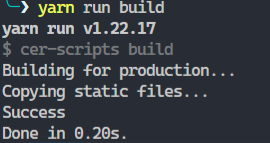
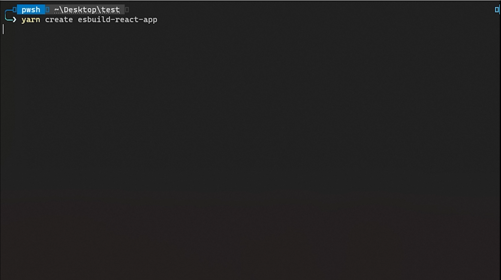

# Create ESbuild React app

An extremly fast tool that allows you to create React apps that compile with ESbuild.

## Features

- Extremly fast
- Easy to use

## How to use

### Create app

To create an app run `npx create-esbuild-react-app` in an empty folder.  
You can also use:

- `npm init esbuild-react-app`
- `yarn create esbuild-react-app`

Now install the dependencies:

- `npm install` or
- `yarn`

### Dev server

And time to start the dev server:

- `npm run dev` or
- `yarn dev`

After you have started the dev server you can open the app in your browser.

### Build app

To build the app run:

- `npm run build` or
- `yarn build`

### Some pictures and videos :)

Build time with Firebase package  
  

